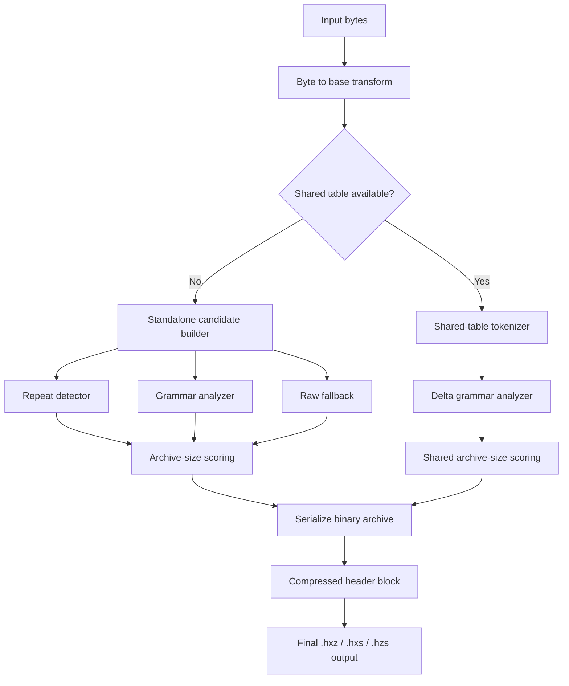

# HelixZip Design Document

Status: current design for `HXZ6` standalone archives, `HZS1` streamed archives, and `HXS4` shared-table archives.

This document explains how HelixZip works today, why the current structure exists, and where the important trade-offs are. It complements [README.md](README.md), which focuses on usage, and [BENCHMARKS.md](BENCHMARKS.md), which tracks measured results across iterations.
For the proposed successor architecture, see [HXZ7_DESIGN.md](HXZ7_DESIGN.md).

## 1. Overview

HelixZip is a grammar-oriented compression experiment built around a DNA-style symbol space.

The core idea is:

1. Convert each byte into four 2-bit "bases" (`A/C/G/T`).
2. Repeatedly replace frequent adjacent symbol pairs with new derived symbols.
3. Keep the smallest intermediate representation found during that process.
4. Store enough binary metadata for the decoder to rebuild the original bytes.

The system has three archive families:

- `HXZ6`: standalone archive, self-contained.
- `HXS4`: shared-table archive, references a separately distributed table.
- `HZS1`: streamed container, a sequence of independent standalone frames.

The current implementation exists in two codebases:

- [helixzip.py](helixzip.py): full reference implementation, including shared-table mode.
- [helixzip_cpp.cpp](helixzip_cpp.cpp): native standalone, streamed, and HX7 subset implementation compatible with Python outputs for standalone and `zlib`-selected blocks.

## 2. Design Goals

- Keep the on-disk archive format binary and compact. No JSON is stored inside `.hxz`, `.hxs`, or `.hzs`.
- Use the same compression family for header metadata and body metadata so the format is internally consistent.
- Support highly repetitive data efficiently, including exact repeats and repeated data with a trailing suffix.
- Fall back gracefully on incompressible data instead of forcing grammar output that loses both time and size.
- Support bounded-memory streaming for large files.
- Support multi-core encode/decode for streamed workloads.
- Keep the Python and C++ standalone/stream formats compatible.
- Allow iteration counts and shared tables to be optional at the CLI, while preserving deterministic decode behavior.

## 3. Non-Goals

- Backward compatibility with older archive versions. The project intentionally optimized for the current format family.
- Cryptographic security. HelixZip is a compressor, not an encryption scheme.
- Best-in-class general-purpose compression on arbitrary workloads.
- Statistical entropy coding, arithmetic coding, or deep context modeling.
- Zero-sidecar shared mode in every workflow. Shared compression still depends on a separately available table, even if the CLI can auto-generate one for convenience.

## 4. Architecture At A Glance

The important design choice is that HelixZip does not commit to grammar mode up front. It builds and scores multiple candidates and then emits the smallest legal archive among them.

## 5. Terminology

- Base symbol: one of four initial symbols, mapped from 2-bit chunks. In the current implementation, `0=A`, `1=C`, `2=G`, `3=T`.
- Derived symbol: any symbol `>= 4`, representing a pair of earlier symbols.
- Rule: a tuple `(left, right)` that defines a derived symbol.
- Stream: the sequence of base and derived symbols that remains after substitutions.
- Grammar block: a pair `(rules, stream)`.
- Shared table: a reusable rule set distributed separately from a payload archive.
- Delta rules: rules added on top of a shared table for one specific payload.
- Repeat mode: a standalone body mode that stores `repeat_unit + repeat_tail` instead of grammar or raw bytes.

## 6. Core Data Representation

### 6.1 Byte-To-Base Transform

Each input byte is split into four 2-bit values:

- bits 7-6
- bits 5-4
- bits 3-2
- bits 1-0

This makes the initial alphabet fixed at size 4. The transform is reversible and simple, and it gives the grammar builder a small, stable starting symbol space.

### 6.2 Derived Symbol Space

Rule numbering is implicit:

- symbols `0..3` are base symbols
- symbol `4` is the first derived rule
- symbol `5` is the second derived rule
- and so on

This avoids storing explicit symbol IDs in the archive body.

### 6.3 Symbol Packing

HelixZip packs the stream at the minimum width required for the current symbol count:

- `bit_width = ceil(log2(symbol_count))`
- packed payload bytes = `ceil(stream_length * bit_width / 8)`

This means the body bit width changes as rules are added.

### 6.4 Integer Encoding

All lengths, counters, and metadata integers are stored as unsigned varints. This keeps small values compact and allows the format to scale beyond 32-bit file sizes.

## 7. Compression Pipeline

### 7.1 Candidate Modes

Standalone compression can emit three body modes:

- `grammar`: grammar rules plus packed symbol stream
- `raw`: original bytes stored directly
- `repeat`: repeated prefix unit plus optional tail

Shared compression emits:

- shared table reference
- optional delta rules
- packed symbol stream

### 7.2 Grammar Discovery

The grammar builder is intentionally simple and greedy.

Algorithm outline:

1. Start with the full base stream.
2. Count adjacent symbol pairs.
3. Consider the top `candidate_limit` pairs by frequency. The current implementation uses `32`.
4. Replace the first pair whose substitution has positive net gain.
5. Append the new rule.
6. Measure the serialized size of the resulting grammar block.
7. Remember the smallest grammar block seen so far.
8. Stop when no good pair remains, replacements drop below `3`, or size improvements stall.

Current stopping rules:

- `replacements < 3` stops the loop because the rule cost is no longer justified.
- `GRAMMAR_STALL_LIMIT = 4` stops after four non-improving iterations.

The pair net-gain heuristic is:

- `net_gain = replacements - 2`

The `-2` reflects the cost of storing a two-symbol rule definition.

This is not guaranteed to produce a globally optimal grammar. It is deliberately greedy because the project optimizes for simplicity and speed over exhaustive search.

### 7.3 Best-Intermediate Selection

HelixZip does not assume the final grammar iteration is the smallest.

Instead, it tracks:

- the best block seen so far
- the iteration count at which that best block occurred

This is the foundation for auto-tuned `--iterations`: the compressor already has the intermediate sizes in hand, so it can retain the best one without doing a second search.

### 7.4 Repeat-Pattern Detection

Before committing to grammar mode, standalone compression checks whether the payload is better represented as repeated bytes.

Current repeat design:

- search prefix units from length `1` to `min(256, len(data) - 1)`
- count how many full repeats of that prefix occur at the start of the payload
- allow a remaining tail after the repeated prefix region
- choose the smallest `len(unit) + len(tail)` candidate
- return early on an exact-repeat hit

This captures:

- exact full-file repeats such as `ACGTACGT...`
- repeated record corpora ending in a truncated final record

Repeat mode is especially effective on highly regular data and is responsible for HelixZip's strongest compression wins on the benchmark corpus.

### 7.5 Raw Fallback

Raw mode exists for fairness and practicality.

Without it, the compressor would spend time building grammars that can only make random or noisy inputs larger. With raw fallback:

- the archive remains valid and binary
- decode remains simple
- size overhead stays bounded on incompressible data

Raw mode is always a candidate in standalone compression.

### 7.6 Grammar Gating

HelixZip uses a lightweight heuristic to decide whether grammar exploration is worth attempting:

- if `max_iterations <= 0` or payload size `< 2`, skip grammar
- if payload size `< 128`, always try grammar
- otherwise, only try grammar if the most frequent byte pair occurs at least `8` times

This avoids expensive grammar work on obviously noisy data.

### 7.7 Auto Iteration Tuning

When `--iterations` is omitted:

- Python and C++ use an internal search budget of `AUTO_MAX_ITERATIONS = 128`
- the grammar builder still stops early if no more useful substitutions exist
- the chosen archive records the best iteration count it actually kept

Important nuance:

- standalone auto mode records the selected iteration count for grammar bodies
- raw and repeat bodies record `0`, because no body grammar was used
- shared auto mode records the number of selected delta rules
- streamed prelude records `0` when the user omitted a global iteration limit, while each frame still records its own chosen count

So "auto" is not an exhaustive external search across arbitrary parameter values. It is "keep the best intermediate within one grammar exploration run."

### 7.8 Shared-Table Compression

Shared mode separates cross-file structure from per-file variation.

The flow is:

1. Build a shared rule table from representative training data.
2. Convert a payload into the base stream.
3. Tokenize the base stream with the shared table using longest-match trie traversal.
4. Optionally add delta rules on top of that seeded stream.
5. Store only the table ID, delta rules, and final stream in the payload archive.

This works best when many payloads come from the same domain and repeatedly reuse the same motifs.

## 8. Archive Formats

All archive formats are binary. Shared tables now have a compact binary `HX7T` distribution format, while legacy JSON tables remain accepted only as a compatibility helper path in the Python CLI.

### 8.1 Common Binary Building Blocks

- Magic bytes identify the archive family.
- Varints encode integer fields.
- Grammar blocks encode:
  - rule list as varint pairs
  - packed symbol stream at the minimum symbol width
- Header metadata is first assembled as raw binary, then compressed with the same grammar algorithm as the body family.

### 8.2 Standalone Archive: `HXZ6`

High-level layout:

| Field | Type | Meaning |
| --- | --- | --- |
| magic | 4 bytes | `HXZ6` |
| header_size | varint | size of the uncompressed header metadata |
| header_rule_count | varint | number of rules in the compressed header block |
| header_stream_length | varint | number of symbols in the compressed header stream |
| header_block | grammar block | compressed header metadata |
| body | mode-dependent | grammar payload, raw payload, repeat payload, or lz payload |

Uncompressed standalone header metadata fields:

| Field | Type | Meaning |
| --- | --- | --- |
| body_mode | varint | `0=grammar`, `1=raw`, `2=repeat`, `3=lz` |
| original_size | varint | original input byte length |
| requested_iterations | varint | explicit iteration budget or chosen auto result |
| primary_value | varint | grammar rule count, `0`, repeat unit length, or lz payload length |
| secondary_value | varint | grammar stream length, `0`, repeat count, or `0` for lz |

Body interpretation:

- grammar body:
  - rules and packed stream
  - body rule count = `primary_value`
  - body stream length = `secondary_value`
- raw body:
  - exactly `original_size` raw bytes
- repeat body:
  - `repeat_unit` bytes first, length = `primary_value`
  - `repeat_count = secondary_value`
  - `repeat_tail_length = original_size - len(repeat_unit) * repeat_count`
  - remaining bytes are `repeat_tail`
- lz body:
  - exactly `primary_value` payload bytes follow
  - the payload is a sequence of literal/match commands encoded with varints
  - each command starts with `literal_len`, followed by literal bytes
  - if bytes remain after that literal, the command also carries `match_len` and `match_distance`
  - the final command may be literal-only and terminate at payload EOF

### 8.3 Shared Archive: `HXS4`

High-level layout:

| Field | Type | Meaning |
| --- | --- | --- |
| magic | 4 bytes | `HXS4` |
| header_size | varint | size of uncompressed shared header metadata |
| header_rule_count | varint | header grammar rule count |
| header_stream_length | varint | header grammar stream length |
| header_block | grammar block | compressed shared header metadata |
| body | grammar block | delta rules plus packed stream |

Uncompressed shared header metadata fields:

| Field | Type | Meaning |
| --- | --- | --- |
| original_size | varint | original payload size |
| requested_iterations | varint | explicit delta budget or chosen auto result |
| shared_rule_count | varint | rules expected in the external table |
| delta_rule_count | varint | delta rules stored in this archive |
| stream_length | varint | packed body stream symbol count |
| table_id | 8 raw bytes | truncated digest of the shared rule payload |

Important properties:

- the archive does not embed the shared table
- the archive embeds only the 8-byte table ID and the count of shared rules
- the decoder must supply the matching shared table externally

### 8.4 Streamed Archive: `HZS1`

High-level layout:

| Field | Type | Meaning |
| --- | --- | --- |
| magic | 4 bytes | `HZS1` |
| chunk_size | varint | configured chunk size in bytes |
| requested_iterations | varint | explicit stream-level budget or `0` for auto |
| frames | repeated | ordered sequence of independent `HXZ6` frames |

Each frame is:

| Field | Type | Meaning |
| --- | --- | --- |
| frame_length | varint | byte size of the next frame |
| frame_payload | bytes | one complete standalone `HXZ6` archive |

Design consequences:

- each chunk is independently decompressible
- chunk modes can differ within one stream archive
- memory use is bounded by chunk size and worker buffering
- output order is preserved exactly

## 9. Header Compression Design

One of the core requirements was that metadata live in the header and use the same compression family.

HelixZip does this by:

1. assembling raw binary header metadata
2. compressing that metadata with the grammar algorithm
3. storing the compressed header block before the body

Header compression rules:

- header grammar iterations are capped at `HEADER_MAX_ITERATIONS = 32`
- at least one header compression pass is attempted, even when the body records `requested_iterations = 0`

This means metadata stays binary and self-contained while still benefiting from the same motif-oriented encoding family as the rest of the archive.

## 10. Size Estimation And Candidate Scoring

Earlier iterations compared archive candidates by serializing whole archives repeatedly. That was simple but wasteful.

The current design uses exact archive-size estimators during scoring:

- varint sizes are computed directly
- packed stream size is computed directly from stream length and bit width
- header block size is computed from compressed header metadata
- body size is computed from mode-specific formulas

This preserves exact candidate ranking while reducing encode time, especially on highly repetitive inputs where several alternatives are considered before the final archive is serialized once.

## 11. Shared Table Lifecycle

Shared tables are intentionally external to payload archives.

Current lifecycle:

1. Training data is compressed into a rule set.
2. The rule set is serialized and hashed.
3. The first 8 bytes of the SHA-256 digest become the table ID.
4. The table is written as a binary `HX7T` dictionary by default.
5. Payload archives reference only the table ID and shared rule count.

Operational note:

- if `compress-shared` is run without `--table`, the CLI builds a table from the input payload itself and writes `<archive>.table.hx7t`
- this is useful for convenience and local testing
- for production shared-mode gains across many files, a representative training corpus is still the better design

## 12. Multi-Core And Streaming Design

### 12.1 Python

Python uses `multiprocessing` with `fork` and ordered `imap`.

Properties:

- parent process reads chunks and writes frames
- worker processes compress or decompress independent chunks
- `imap` preserves input order
- passing `--workers 0` expands to all available CPU cores

Trade-off:

- process startup and IPC overhead are higher than a native thread pool
- on larger repetitive workloads the parallel speedup is still meaningful

### 12.2 C++

C++ uses `std::async` with a bounded in-flight future queue.

Properties:

- at most `workers` futures are in flight
- results are flushed in original order
- memory remains bounded by queue depth and chunk size

Trade-off:

- `std::async` is simple and portable
- a custom thread pool could reduce overhead and improve predictability further

## 13. Decode Path And Validation

Decode is intentionally stricter than the encoder.

Current invariants checked during decode:

- correct magic bytes
- valid varint boundaries
- payload lengths match declared lengths
- symbol payload contains the expected number of symbols
- repeat metadata does not exceed original size
- shared table ID matches the archive
- shared rule count matches the external table
- no trailing bytes remain after parse

Grammar expansion uses an explicit stack, not recursive descent, for the main decode path. That keeps the decoder more robust on deep rule chains.

## 14. CLI Surface

Python CLI currently supports:

- standalone compress/decompress/inspect
- streamed compress/decompress
- shared-table build/compress/decompress/inspect

C++ CLI currently supports:

- standalone compress/decompress/inspect
- streamed compress/decompress

Shared-table archives are still Python-only on the encode/decode side.

## 15. Performance Characteristics

HelixZip is strongest on:

- exact repetition
- short repeating motifs
- repeated structured text or record prefixes
- workloads where a reusable shared table captures domain motifs

HelixZip is weaker on:

- high-entropy binary payloads
- workloads where entropy coding dominates grammar reuse
- mixed real-world corpora with little repeated adjacent structure

Current benchmark highlights are tracked in [BENCHMARKS.md](BENCHMARKS.md). Representative measurements from the current iteration include:

- `zeros-64k` -> `17` bytes
- `acgt-64k` -> `20` bytes
- `text-64k` -> `151` bytes
- `ldif-64k` -> `9308` bytes
- `random-8k` -> `8205` bytes
- local LDIF sample `13,015,346` bytes -> `723,326` bytes in `lz` mode
- Python streamed benchmark on `2.14 MB` -> `529.329 ms` median with `workers=1`, `319.997 ms` median with `workers=2`
- C++ streamed benchmark on the same workload -> `17.272 ms` median with `workers=1`, `18.383 ms` median with `workers=2`

These numbers show that repeat mode still dominates exact repeats, the new `lz` body mode fixes the earlier structured-text raw fallback gap, and stream parallelism is helpful in Python but still needs more tuning in the C++ path.

## 16. Testing And Verification

The project currently verifies:

- standalone round-trips
- shared-table round-trips
- raw fallback behavior
- repeat mode and repeat-with-tail behavior
- stream round-trips
- multi-worker stream round-trips
- auto-iteration behavior
- auto-generated shared-table sidecar behavior
- archive-size estimator correctness
- Python/C++ compatibility for standalone and streamed archives

The main test file is [test_helixzip.py](test_helixzip.py).

## 17. Known Limitations

- Grammar search is greedy and only considers adjacent pairs.
- The pair candidate set is capped and not globally optimized.
- LZ mode uses a small fixed hash-chain matcher and still has no entropy stage after tokenization.
- There is no entropy coder after grammar packing.
- Shared tables now have a compact binary `HX7T` format, but the `HXS4` archive family itself still carries only a table ID rather than embedding the dictionary.
- Shared-table archives are not yet implemented in C++.
- Stream chunk size is user-configured, not auto-tuned.
- The stream prelude stores the requested stream-level iteration budget, not a summary of the per-frame chosen counts.
- The project intentionally dropped backward compatibility with earlier archive layouts.

## 18. Future Work

Likely next improvements:

- optimize grammar discovery further, especially on non-repeat grammar workloads
- replace C++ `std::async` with a dedicated thread pool
- add C++ support for `HXS4` shared-table archives
- design a compact binary shared-table distribution format
- add chunk-size auto-selection for stream mode
- explore more expressive rule scoring than the current pair-frequency heuristic
- optionally add a final entropy-coding stage if the project wants to compete more directly with mature codecs

## 19. Summary

HelixZip's current design is built around one central compromise:

- keep the format simple, binary, inspectable, and fast enough to iterate on
- accept that the grammar model is heuristic rather than globally optimal

That compromise is working well for the current goal set. The format now has:

- compressed binary headers
- standalone, shared, and streamed variants
- raw fallback for noisy data
- repeat mode for highly repetitive data
- optional auto-tuned iteration budgets
- optional shared-table generation for Python workflows
- multi-core streaming
- C++ parity for the standalone and streamed formats

For a prototype-oriented compression project, that is a solid foundation for future optimization passes.
